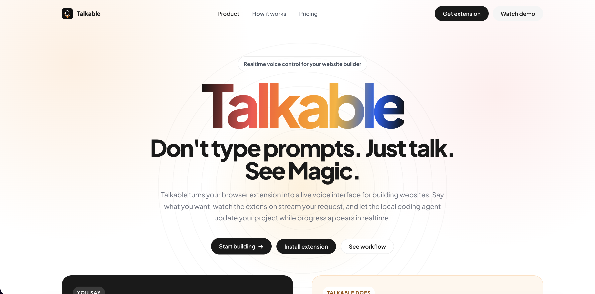
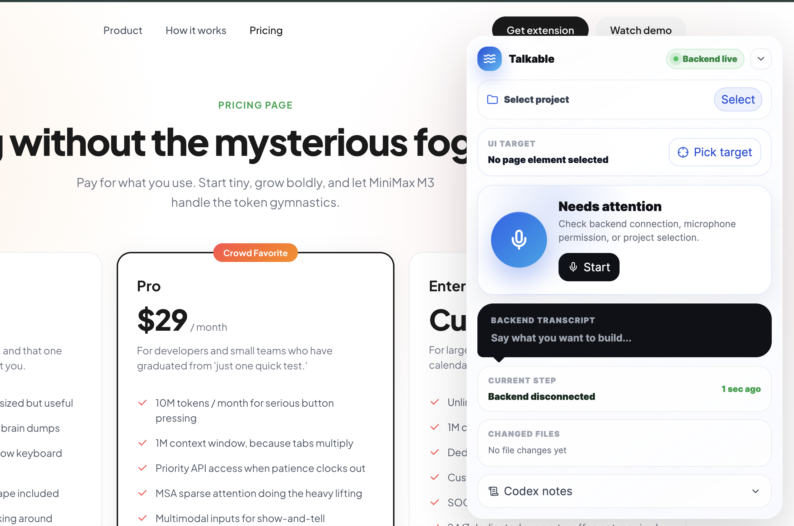
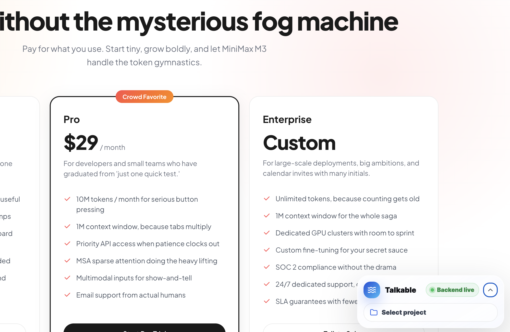
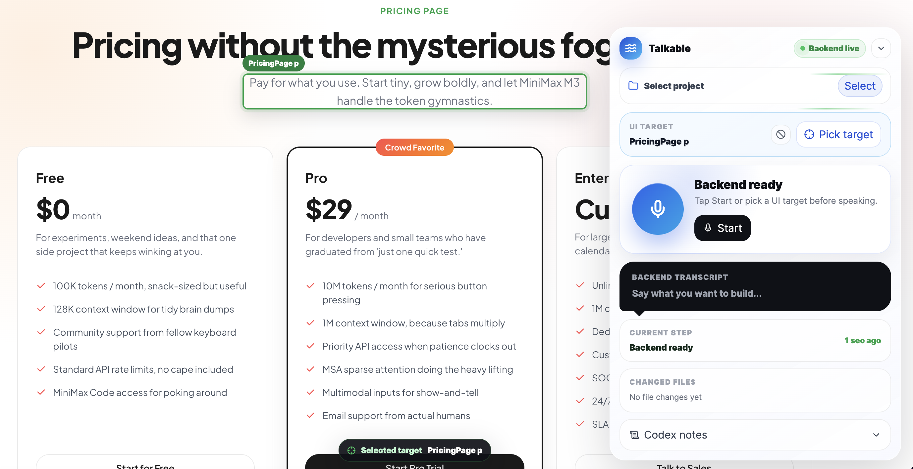

# Talkable

## Overview
Talkable is a voice-controlled Codex platform that lets non-technical users, marketing teams, sales teams, and product stakeholders request UI and dashboard changes using Voice . Instead of writing a detailed developer prompt or ticket, users can simply say what they want changed, watch the AI interpret the request, and send the resulting implementation work toward the development workflow.

The project includes a Chrome extension, a local backend, shared validation schemas, and a React landing page. The extension captures voice instructions, sends them to the backend, transcribes them with OpenAI, and passes the resulting task to Codex so changes can be made in the selected local project.

## Problem Statement
Non-technical teams often know what they want from a dashboard or interface, but they struggle to describe the exact UI changes in developer-friendly language. This creates slow feedback loops, unclear requirements, and extra back-and-forth between business teams and developers.

Talkable solves the gap between "what users mean" and "what developers need to build" by giving teams a voice-first AI agent that can understand spoken intent, convert it into an actionable Codex task, and prepare code changes for developer review.

## Solution
Talkable lets users speak naturally about the interface they want to improve. The Chrome extension streams the user's voice to a local Node.js backend, the backend uses OpenAI transcription to convert speech into text, and Codex receives the task with project context so it can inspect and update the selected codebase.

The goal is to make UI iteration feel immediate for non-technical teams while still keeping developers in control through review, pull requests, and normal engineering workflows.

## Features
- Voice-controlled Chrome extension with a floating start/stop control.
- Local backend that connects browser voice input to OpenAI transcription and Codex.
- Natural-language task creation for UI, dashboard, and product changes.
- Project path configuration so Codex works inside the selected local codebase.
- Optional Codex thread support for continuing previous work.
- Real-time status updates for listening, processing, Codex progress, completion, and errors.
- UI element selection context so a user can point the agent at the part of the page they want changed.
- Shared Zod schemas for validating client/server events, settings, and UI selections.
- Undo-related event support for tracking and reversing recent Codex changes.
- Text-to-speech response support for spoken task confirmations.
- React/Vite landing page for presenting the product.

## Tech Stack
- Frontend: React 19, Vite, React Router, CSS
- Browser Extension: Chrome Extension Manifest V3, React, TypeScript, Tailwind CSS, Framer Motion, Lucide React
- Backend: Node.js, TypeScript, WebSocket server using `ws`
- Database: Not connected yet; planned for storing submitted requests, generated change records, and review history
- APIs: OpenAI Audio Transcriptions, OpenAI Text-to-Speech, `@openai/codex-sdk`
- Validation: Zod shared schemas
- Hosting: Local development currently; landing page can be hosted on Vercel, Netlify, or any static hosting provider

## Codex / OpenAI Usage
Codex and OpenAI are core to the project:

- Ideation: Used to shape the voice-first workflow for non-technical teams.
- Architecture planning: Designed the Chrome extension, local backend, shared package, and Codex execution flow.
- Code generation: Codex can receive spoken tasks and generate code changes inside a selected local project.
- Debugging: Codex progress and error events are streamed back to the extension to help users understand what is happening.
- Testing: The repo includes TypeScript checks and build commands for validating the shared package, backend, and extension.
- Documentation: This README documents the product concept, stack, local setup, and AI usage.
- API integration: OpenAI transcription converts recorded speech into text, OpenAI TTS can generate spoken confirmations, and the Codex SDK executes engineering tasks.

## Demo
Add your demo or pitch video link here.

Demo link: https://youtu.be/A3HpWlMlpaY

## Screenshots

### Landing page


### Chrome extension popup


### Floating voice control


### UI target selection


## How to Run Locally

Requires Node.js 18 or later.

```bash
git clone https://github.com/unaisshemim/talkable.git
cd talkable
npm install
```

Create a `.env` file in the project root or backend workspace and add your OpenAI API key:

```bash
OPENAI_API_KEY=<your-openai-api-key>
```

Start the backend and React landing page together:

```bash
npm run dev
```

Or run them separately:

```bash
npm run dev:server   # backend at http://127.0.0.1:4317
npm run dev:react    # landing page at http://127.0.0.1:5173
```

Build the Chrome extension:

```bash
npm run build -w @talkable/extension
```

Then load this folder as an unpacked Chrome extension:

```bash
apps/extension/dist
```

Run checks:

```bash
npm run check
```

Build everything:

```bash
npm run build
```

## Environment Variables

```bash
OPENAI_API_KEY=<required>
OPENAI_TRANSCRIPTION_MODEL=whisper-1
OPENAI_TRANSCRIPTION_LANGUAGE=en
OPENAI_TTS_MODEL=gpt-4o-mini-tts
OPENAI_TTS_VOICE=marin
OPENAI_TTS_ENABLED=true
PORT=4317
HOST=127.0.0.1
```

## Project Structure

```text
apps/react       React/Vite product landing page
apps/extension   Chrome extension popup and floating content-script voice UI
apps/server      Local Node.js backend for voice, transcription, WebSocket sessions, and Codex
packages/shared  Shared Zod schemas and TypeScript event contracts
docs             Product requirements and planning notes
```

## Notes
- Repository: [github.com/unaisshemim/talkable](https://github.com/unaisshemim/talkable)
- Demo video link will be added after recording.
- Database persistence is planned but not connected in the current local MVP.
