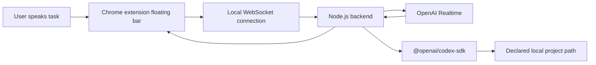

# PRD: Voice-Controlled Codex Chrome Extension

## 1. Summary

Build a simple Chrome extension with a floating start/stop voice bar that streams the user's voice from the browser to a local Node.js backend. The backend connects to OpenAI Realtime for speech-to-text and task interpretation, then controls local Codex through the Codex TypeScript SDK so Codex can inspect and update a user-selected local project. The frontend must show realtime task progress, Codex events, and final status.

The product is Codex-focused only. It should not provide a general ChatGPT chat surface. Voice instructions are translated into Codex engineering tasks, executed against the configured project path, and reported back as live progress.

## 2. Goals

- Provide a Chrome extension floating toolbar with clear `Start` and `Stop` controls.
- Capture microphone audio in the extension frontend and stream it to the local backend.
- Use a Node.js backend to connect audio streams to OpenAI Realtime.
- Convert the user's spoken task into a validated Codex task request.
- Control Codex server-side through `@openai/codex-sdk`.
- Let the user declare the local project path that Codex should modify.
- Stream Codex progress back to the extension in realtime.
- Use the Vercel AI SDK where useful for structured model interaction and streaming orchestration.
- Use Zod for runtime validation of all client/server event payloads, settings, and task inputs.

## 3. Non-Goals

- No general-purpose ChatGPT chat UI.
- No cloud-hosted code editing in the MVP.
- No automatic project deletion, destructive git reset, or broad filesystem mutation.
- No browser extension store publishing workflow in the MVP.
- No multi-user collaboration in the MVP.
- No production OAuth system in the MVP.

## 4. Target Users

- Developers who want to control Codex by voice while working in Chrome.
- Internal tool builders who want to integrate Codex into local engineering workflows.
- Users who prefer dictating coding tasks and watching progress without leaving the browser.

## 5. Core User Flow

1. User starts the local Node.js backend.
2. User installs or loads the unpacked Chrome extension.
3. User opens the extension settings and enters:
   - Local backend URL.
   - Absolute project path.
   - Option to select the folder so it can map easily.
   - Optional Codex thread ID to resume.
4. User clicks `Start` on the floating bar.
5. Extension requests microphone permission if needed.
6. Extension streams microphone audio to the backend.
7. Backend forwards audio to OpenAI Realtime.
8. Realtime model emits transcript and task intent.
9. Backend validates the task with Zod.
10. Backend starts or resumes a Codex thread using `@openai/codex-sdk`.
11. Codex works in the declared project path.
12. Backend streams progress events to the extension.
13. Floating bar shows:
    - Listening state.
    - Transcript snippets.
    - Current Codex step.
    - Files changed.
    - Errors or approval-needed state.
14. User clicks `Stop` to end audio streaming.

## 6. MVP Features

### 6.1 Chrome Extension Floating Bar

The extension injects a compact floating control into active tabs.

Required controls:

- `Start` button.
- `Stop` button.
- Connection status indicator.
- Microphone/listening indicator.
- Current task status.
- Expand/collapse progress panel.

Required states:

- `Disconnected`: backend unavailable.
- `Ready`: backend connected and project path configured.
- `Listening`: microphone streaming active.
- `Processing`: backend/Realtime model is deriving a task.
- `Codex Running`: Codex is executing the task.
- `Needs Attention`: Codex requires user approval or manual input.
- `Done`: task completed.
- `Error`: task failed.

### 6.2 Extension Settings

Settings must be available from the extension popup.

Fields:

- Backend URL, default `http://127.0.0.1:4317`.
- Project path, required before starting a Codex task.
- Optional Codex thread ID.
- Audio input device, optional.
- Realtime voice/transcription settings, optional.

Validation:

- Backend URL must be a valid local HTTP or HTTPS URL.
- Project path must be a non-empty absolute path.
- Thread ID, if present, must be a non-empty string.

### 6.3 Audio Streaming

The extension should use browser microphone APIs to capture audio and stream chunks to the backend over WebSocket.

MVP requirements:

- Start capture only after user clicks `Start`.
- Stop capture immediately after user clicks `Stop`.
- Show microphone permission errors clearly.
- Do not persist raw audio by default.
- Send audio in a format accepted or convertible by the backend for Realtime streaming.

### 6.4 Node.js Backend

The backend is a local server that brokers communication between the extension, OpenAI Realtime, and Codex.

Required responsibilities:

- Expose health endpoint.
- Expose WebSocket endpoint for extension sessions.
- Validate all incoming messages with Zod.
- Manage OpenAI Realtime session.
- Manage Codex thread lifecycle.
- Enforce project path configuration.
- Stream progress events back to frontend.
- Handle cancellation.
- Keep secrets server-side.

Runtime:

- Node.js 18 or newer.
- TypeScript.

Core dependencies:

- `@openai/codex-sdk`.
- `zod`.
- `ai` from the Vercel AI SDK where useful for structured generation/streaming orchestration.
- OpenAI client/runtime package required by the selected Realtime implementation.
- WebSocket server package such as `ws` or a framework-native equivalent.

### 6.5 OpenAI Realtime Integration

The backend connects to OpenAI Realtime for low-latency speech interaction.

Expected behavior:

- Receive streamed audio from extension.
- Produce partial transcript events.
- Detect task boundaries.
- Convert the spoken request into a structured Codex task.
- Return short realtime status messages suitable for the floating UI.

The Realtime layer should produce structured output like:

```json
{
  "intent": "codex_task",
  "task": "Update the login page button styling and run tests",
  "requiresCodex": true
}
```

### 6.6 Codex SDK Integration

Use the Codex TypeScript SDK server-side.

Reference usage shape:

```ts
import { Codex } from "@openai/codex-sdk";

const codex = new Codex();
const thread = codex.startThread();
const result = await thread.run("Make a plan to diagnose and fix the CI failures");
```

MVP behavior:

- Start a new Codex thread when no thread ID is configured.
- Resume an existing Codex thread when the user provides a thread ID.
- Send the validated voice-derived task to Codex.
- Continue on the same thread for follow-up voice tasks.
- Return the active thread ID to the frontend.
- Surface Codex result, progress, approval-needed state, and errors.

Project path behavior:

- User declares the project path in extension settings.
- Backend validates that the path exists before starting Codex.
- Codex must operate only on the declared path.
- Backend must reject tasks when no valid project path is configured.

The exact SDK option for setting Codex working directory must be verified during implementation against current `@openai/codex-sdk` documentation. If the SDK does not directly accept a working directory, the backend must use the officially supported Codex project/session configuration mechanism rather than shelling into arbitrary directories without validation.

### 6.7 Realtime Progress UI

The frontend progress panel should show an append-only event feed.

Event types:

- Backend connected.
- Audio started.
- Audio stopped.
- Partial transcript.
- Final transcript.
- Task created.
- Codex thread started/resumed.
- Codex status update.
- File changed.
- Tests started.
- Tests completed.
- Approval required.
- Task completed.
- Task failed.

Each event should show:

- Timestamp.
- Event type.
- Short human-readable message.
- Optional details.

## 7. Data Contracts

All payloads must be validated with Zod on the backend. Shared schemas should live in a shared package or shared source folder used by both extension and backend.

### 7.1 Client to Server Events

```ts
const ClientEventSchema = z.discriminatedUnion("type", [
  z.object({
    type: z.literal("session.configure"),
    backendUrl: z.string().url().optional(),
    projectPath: z.string().min(1),
    codexThreadId: z.string().min(1).optional()
  }),
  z.object({
    type: z.literal("audio.start"),
    sampleRate: z.number().int().positive(),
    format: z.enum(["pcm16", "webm-opus"])
  }),
  z.object({
    type: z.literal("audio.chunk"),
    data: z.string().min(1)
  }),
  z.object({
    type: z.literal("audio.stop")
  }),
  z.object({
    type: z.literal("codex.cancel")
  })
]);
```

### 7.2 Server to Client Events

```ts
const ServerEventSchema = z.discriminatedUnion("type", [
  z.object({
    type: z.literal("status"),
    state: z.enum([
      "disconnected",
      "ready",
      "listening",
      "processing",
      "codex_running",
      "needs_attention",
      "done",
      "error"
    ]),
    message: z.string()
  }),
  z.object({
    type: z.literal("transcript.partial"),
    text: z.string()
  }),
  z.object({
    type: z.literal("transcript.final"),
    text: z.string()
  }),
  z.object({
    type: z.literal("codex.thread"),
    threadId: z.string()
  }),
  z.object({
    type: z.literal("codex.progress"),
    message: z.string(),
    details: z.record(z.unknown()).optional()
  }),
  z.object({
    type: z.literal("codex.file_changed"),
    path: z.string(),
    action: z.enum(["created", "updated", "deleted", "unknown"])
  }),
  z.object({
    type: z.literal("codex.approval_required"),
    message: z.string()
  }),
  z.object({
    type: z.literal("codex.done"),
    summary: z.string(),
    changedFiles: z.array(z.string()).default([])
  }),
  z.object({
    type: z.literal("error"),
    code: z.string(),
    message: z.string()
  })
]);
```

## 8. Suggested Architecture



Recommended repository layout:

```text
apps/
  extension/
    manifest.json
    src/
      content/
      popup/
      background/
      shared/
  server/
    src/
      index.ts
      realtime/
      codex/
      schemas/
packages/
  shared/
    src/
      events.ts
      settings.ts
docs/
  prd.md
```

## 9. Security and Privacy

- Store OpenAI API keys only in backend environment variables.
- Never expose OpenAI API keys to the Chrome extension.
- Only allow local backend origins by default.
- Require explicit project path configuration before Codex can run.
- Validate that configured project path exists.
- Prevent path traversal outside the configured project root for any backend file metadata.
- Do not persist raw microphone audio by default.
- Do not send arbitrary local files to the Realtime model unless required for the task and surfaced through Codex's normal workflow.
- Add clear UI when Codex requires approval for commands or edits.
- Log high-level events, not raw secrets or full audio payloads.

## 10. Error Handling

Required errors:

- Backend unreachable.
- Microphone permission denied.
- Invalid project path.
- Missing OpenAI API key.
- Realtime session failed.
- Codex SDK failed to start.
- Codex task failed.
- Codex requires approval.
- WebSocket disconnected.

Each error must include:

- Stable error code.
- Human-readable message.
- Recoverable or non-recoverable classification.
- Suggested next action.

## 11. Milestones

### Milestone 1: Skeleton

- Create monorepo structure.
- Add TypeScript config.
- Add extension manifest.
- Add backend server with health endpoint.
- Add shared Zod schemas.

### Milestone 2: Floating Bar and Settings

- Implement floating bar injection.
- Implement popup settings.
- Persist settings in Chrome storage.
- Connect extension to backend WebSocket.

### Milestone 3: Audio Streaming

- Capture microphone audio.
- Stream audio chunks to backend.
- Show listening and stop states.
- Add cancellation.

### Milestone 4: Realtime Integration

- Connect backend to OpenAI Realtime.
- Stream audio to Realtime.
- Emit partial/final transcripts.
- Produce structured Codex task intent.

### Milestone 5: Codex Integration

- Install and configure `@openai/codex-sdk`.
- Start/resume Codex threads.
- Pass voice-derived tasks to Codex.
- Configure Codex to operate on the declared project path.
- Stream progress and final result to extension.

### Milestone 6: Hardening

- Add path validation.
- Add better error states.
- Add reconnect behavior.
- Add tests for Zod schemas and backend event handling.
- Add manual QA checklist.

## 12. Acceptance Criteria

- User can load the unpacked Chrome extension.
- User can configure backend URL and project path.
- Floating bar appears on a normal web page.
- User can click `Start` and grant microphone permission.
- Audio streams to the backend.
- Backend creates a Realtime session.
- Transcript appears in the floating bar.
- A spoken engineering task becomes a validated Codex task.
- Backend starts or resumes a Codex thread.
- Codex operates on the configured local project path.
- Progress events appear in the floating bar while Codex works.
- User can click `Stop` and audio streaming ends.
- Errors are visible and actionable.
- OpenAI API key is never sent to the extension.

## 13. Open Questions

- Which exact OpenAI Realtime model should be used for the first implementation?
- Which audio format should the extension send: raw PCM16 or browser-native WebM/Opus with backend transcoding?
- What is the current official `@openai/codex-sdk` API for setting the working directory/project path?
- Should Codex approval requests be handled in the extension UI, backend terminal, or Codex's native surface?
- Should the frontend show raw Codex logs or only summarized progress?
- Should follow-up voice commands always reuse the previous Codex thread by default?

## 14. Implementation Notes

- Keep the backend as the only trusted component.
- Treat the extension as an untrusted client even though it runs locally.
- Prefer a shared `packages/shared` module for Zod schemas to prevent frontend/backend drift.
- Use the AI SDK only where it gives concrete value, such as structured output helpers or stream handling. Do not add it as decorative architecture.
- Verify current OpenAI Realtime and Codex SDK APIs before implementation because these surfaces can change.
- Make the first implementation local-only and explicit about that boundary.
